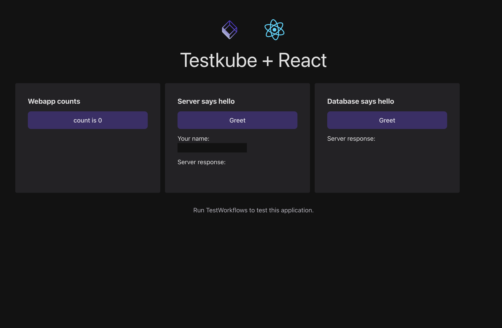

# Testkube Sample Application

A sample 3-tier application to run tests on.
The application is composed of a React frontend, NodeJs backend and a PostgreSQL database.

It can be used to showcase Testkube tests workflows.



## Running the application

You can either use docker-compose.yaml:

```
docker-compose up
```

Or run it locally:

```
npm run start
```

When running locally you should start your own PostgreSQL database.
There are many ways to do this, one suggestion is to use Docker:

```
docker run --name testkube-sample-db \
  -p 15432:5432 \
  -e POSTGRES_DB=api-db \
  -e POSTGRES_USER=api-user \
  -e POSTGRES_PASSWORD=api-password \
  --rm -d postgres
```

## Running tests

Unit tests can be executed without a running appliction:

```
npm run test
```

For E2E test, you should first run the application as described above:

```
npm run test:e2e
```
